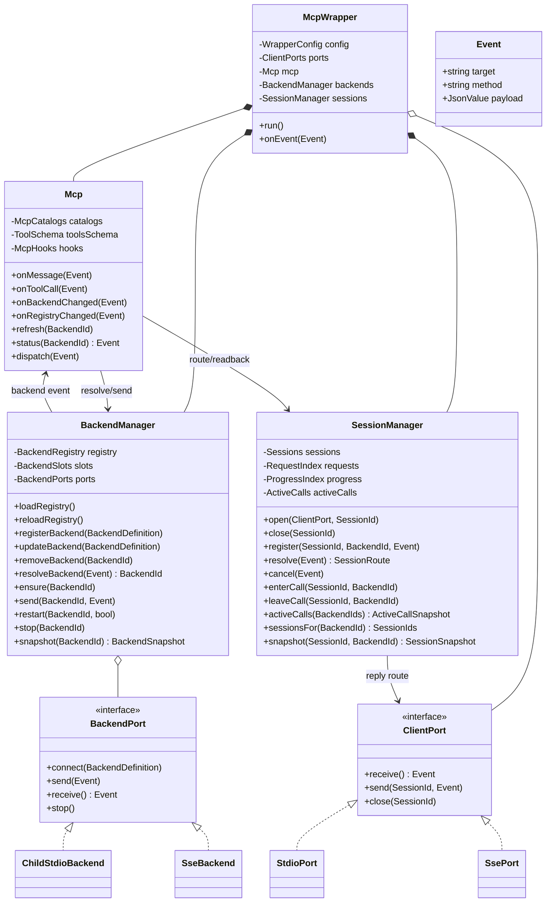

# C++ Rewrite Class Diagram

The rewrite has four state owners. A client transport submits `Event { target, method, payload }`; `McpWrapper` dispatches it to the addressed owner method. `Event`, configuration records, snapshots, and tool payloads are value types, not long-lived owners.



## State owner table

| Class | Retained data | Public methods | Must not own |
| --- | --- | --- | --- |
| `McpWrapper` | configuration and references to its four owners | `run`, `onEvent` | MCP catalog, backend state, session state, transport buffers |
| `ClientPort` | connection, stream/socket handles, output buffer | `receive`, `send`, `close` | MCP data, backend selection, lifecycle decisions |
| `Mcp` | per-backend MCP catalogs, advertised tool schema, MCP hook points | `onMessage`, `onToolCall`, `onBackendChanged`, `onRegistryChanged`, `refresh`, `status`, `dispatch` | process handles, backend lifecycle, client-session maps |
| `BackendManager` | registry, backend definitions, slots, transport adapters, lifecycle and pending backend requests | `loadRegistry`, `registerBackend`, `updateBackend`, `removeBackend`, `resolveBackend`, `ensure`, `send`, `restart`, `stop` | client connection handles and request-to-client reply ownership |
| `SessionManager` | session-to-client-port relation, request-to-session/backend relation, progress indexes, per-session/per-backend active-call counters | `open`, `close`, `register`, `resolve`, `cancel`, `enterCall`, `leaveCall`, `activeCalls`, `sessionsFor`, `snapshot` | backend configuration, process handles, MCP discovery data |

## Registry-owned data

`registry.json` is loaded, validated, and reconciled only by `BackendManager`. It defines backend topology, rather than merely a list of processes to start.

| Registry record | Key | Required data | Used by |
| --- | --- | --- | --- |
| backend | `backendId` | transport kind, endpoint or command, arguments, enablement, lifecycle policy | `BackendManager` creates the matching `BackendPort` and slot |
| route | route id | client selector, MCP selector, target `backendId`, priority | `BackendManager::resolveBackend` selects a backend for an event |
| hook | hook id | MCP event selector, legal `target.method`, enabled state | `Mcp` binds a declared MCP hook point; the target method must be schema-valid |
| tool projection | tool name | exposed MCP tool schema, target action, visibility | `Mcp` builds the advertised tool list and validates calls |

`registry.schema.json` defines the legal shape of every record. An external registry may add or change backend instances, transports, routes, hooks, and MCP tool projection, but it cannot name arbitrary C++ symbols: every configured `target.method` is checked against the compiled owner API schema before it is bound.

## N:N routing contract

The matrix is not encoded as frontend-by-backend code paths. `ClientPort` implementations only turn their transport into events. `BackendPort` implementations only turn their transport into backend events. `SessionManager` records the runtime relation, while `BackendManager` resolves the configured backend.

| Event payload address | Owner | Purpose |
| --- | --- | --- |
| `sessionId` | `SessionManager` | reply to the correct stdio, SSE, or future client connection |
| `backendId` | `BackendManager` | select the backend slot and transport adapter |
| `requestId` | `SessionManager` and `BackendManager` | correlate client, backend, cancellation, and late response handling |
| `data` | target method | method-specific MCP or control data |

The stable event shape remains:

```text
Event {
  target: "mcp" | "backend" | "session",
  method: "...",
  payload: { sessionId, backendId, requestId, data }
}
```

Only the addressed object changes its own retained data. A hook or transport adapter asks another owner through a `target.method(payload)` event or public owner method; it never reaches into another object's storage.
