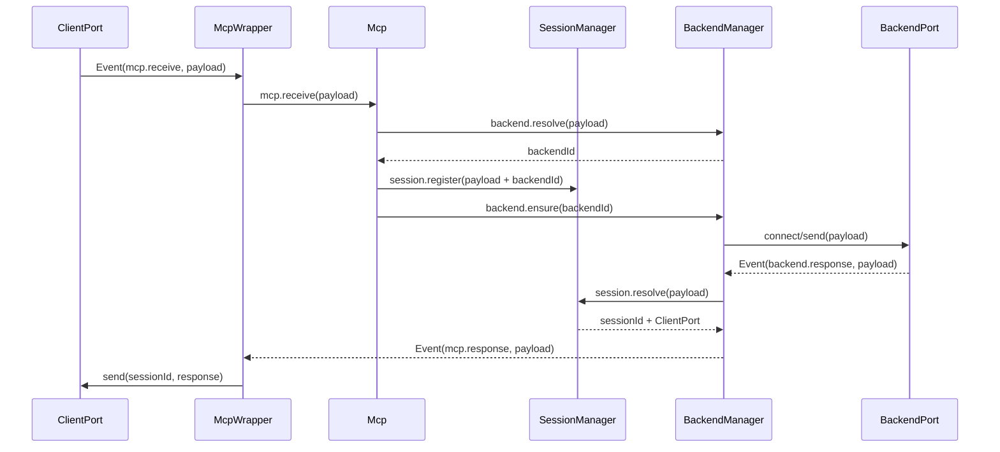
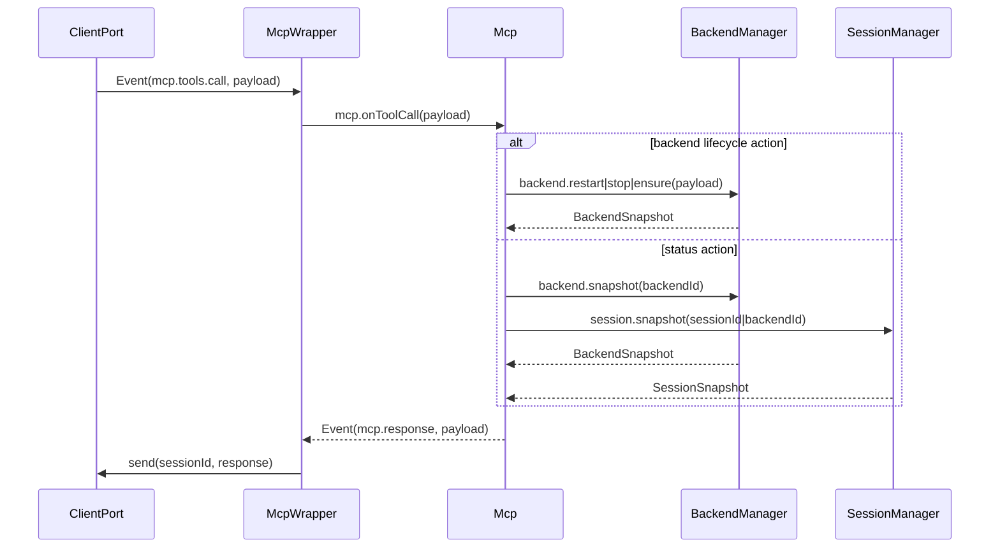
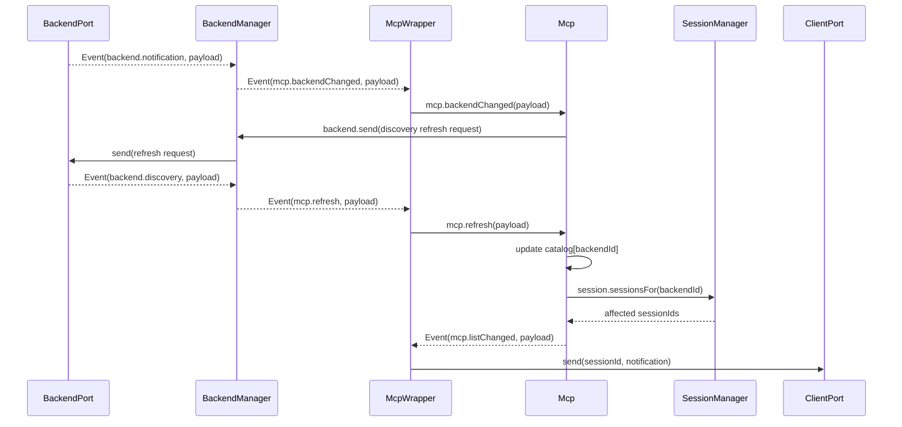
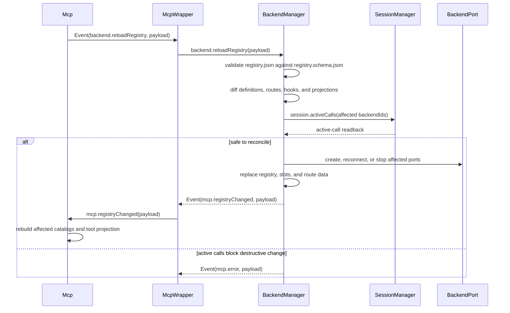

# Class Logic Swimlanes

Each lane is one class. The arrows are legal `Event { target, method, payload }` crossings; they do not imply direct access to another class's retained data. `payload` carries `sessionId`, `backendId`, `requestId`, and method-specific `data` whenever that address is needed.

## Client MCP call

`ClientPort` does not select a backend. `Mcp` asks `BackendManager` for the configured target, and `SessionManager` records the request relation before the backend can reply. The same path works when the client is stdio or SSE and when the backend is a child process or SSE endpoint.

## Wrapper tool call and status readback

`Mcp` validates the advertised tool schema but never edits backend or session state. `BackendManager` and `SessionManager` return snapshots; `Mcp` only projects those snapshots into the MCP response.

## Backend observation and cache refresh

The backend notification is an observation, not cache truth. `Mcp` changes its catalog only after the backend refresh result arrives for the addressed `backendId`.

## Registry reload and topology reconciliation

`BackendManager` owns both the external registry and its live reconciliation. A registry reload cannot silently destroy an active backend call: it asks `SessionManager` for the runtime fact before changing the affected slot or port.
